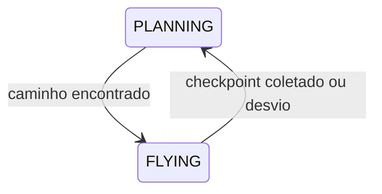

# Agente de Busca Heurística (A* Visual) — Odisseia Orbital

Agente modular baseado em planejamento com A* e piloto automático adaptativo para o ambiente de simulação orbital.

## Arquitetura

```
agents/
├── grid_map.py          — Discretização do espaço em grid 40×30
├── astar_planner.py     — Busca A* geradora com custo gravitacional
├── auto_pilot.py        — Piloto com velocidade-alvo e evasão
├── visualization.py     — Overlay do A*, linha guia, HUD e utilidades
├── replay_buffer.py     — Save/Load de experiências de sucesso (JSON)
├── heuristic_agent.py   — Loop principal e CLI
└── README.md
```

## Módulos

### `grid_map.py` — Mapa Discretizado

Converte o espaço contínuo 800×600 em grid de células 20×20 (40×30).

| Constante | Valor | Descrição |
|---|---|---|
| `CELL_SIZE` | 20 px | Tamanho de cada célula |
| `BASE_SAFETY` | 12 | Margem base ao redor de planetas |
| `MASS_SCALE` | 0.8 | Fator de escala por massa: `margem = 12 + 0.8 × √(massa)` |

**Margens por planeta (exemplos):**
- Gigante gasoso (massa 1200): ~40px de margem
- Planeta pequeno (massa 250): ~25px de margem

`GridMap` também desbloqueia células contendo checkpoints (não coletados) e a estação espacial. Checkpoints já coletados são re-bloqueados.

**Aprendizado por falha:** `global_margin_boost` incrementa +5px a cada colisão/reset. O grid é reconstruído com obstáculos maiores, forçando rotas mais conservadoras.

**Métodos principais:**
```python
gm = GridMap(planets, checkpoints, station_pos, global_margin_boost=0)
gm.pos_to_cell(x, y)       # (float, float) → (row, col)
gm.cell_to_pos(r, c)       # (row, col) → (x, y)
gm.is_passable(r, c)       # bool
gm.increase_margins(+5.0)  # reconstrói grid com margens maiores
```

---

### `astar_planner.py` — Planejador A* com Gravity-Awareness

Busca A* em 8 direções (incluindo diagonais) com **custo gravitacional** por célula.

**Função de custo:**
```
g(n) = distância_euclidiana + 0.5 × Σ (G × massa_planeta / distância_ao_planeta)
```

Células próximas de planetas massivos ficam "caras", fazendo o A* naturalmente desviar para o vácuo espacial.

**Generator (yield):** A busca pausa a cada nó expandido para permitir animação visual. Cada `yield` retorna:
```python
{
    "open":   [(r,c), ...],    # fronteira (azul claro)
    "closed": [(r,c), ...],    # visitados (azul escuro)
    "current": (r,c),          # nó sendo expandido (amarelo)
    "path": None | [(x,y), ...],  # caminho quando encontrado
}
```

**Tratamento de falha:** Se célula inicial ou objetivo estiver bloqueada, BFS encontra a célula passável mais próxima.

---

### `auto_pilot.py` — Piloto Automático

Controlador que segue waypoints com **3 modos de decisão**:

| Condição | Ação |
|---|---|
| `superfície_planeta < 20px` e `fuel ≥ 3` | **EVASÃO** — foge do planeta mais próximo |
| `vel_projetada < 0.3` | **IMPULSO** — navio quase parado na direção do alvo |
| `gravidade_contrária < -0.08` e `vel > 0.3` | **IMPULSO** — gravidade puxando contra o alvo |
| `vel_projetada < 0.8` e `dist > 120` | **IMPULSO** — longe e devagar |
| Nenhuma das anteriores | **COAST** (ação 0) — planar economizando combustível |

**Avanço de waypoints:** Remove waypoints alcançados (< 15px) ou quando o próximo está mais próximo que o atual.

**Parâmetros:**
```python
ap = AutoPilot(path, planets)
ap.get_action(obs)           # retorna ação 0-4
ap.has_path()                # ainda há waypoints?
ap.distance_to_next(x, y)    # distância ao próximo waypoint
```

A observação (`obs`) é o vetor de 7 elementos do ambiente: `[pos_x, pos_y, vel_x, vel_y, fuel, dist_cp, dist_st]`.

---

### `visualization.py` — Renderização

| Função | Descrição |
|---|---|
| `draw_a_star_overlay(screen, state)` | Overlay translúcido com células open/closed/current |
| `draw_path_line(screen, path)` | Linha verde de 3px conectando waypoints |
| `draw_agent_hud(screen, attempt, margin, info, timer)` | HUD com tentativa atual e margem de segurança |
| `simplify_path(path)` | Remove waypoints colineares (cos > 0.95) |
| `get_current_goal(env, ship_pos)` | Retorna checkpoint não coletado **mais próximo** da nave |

---

### `replay_buffer.py` — Buffer de Experiência

Persiste experiências de sucesso em JSON para reuso.

```python
# Salvar (automático ao atracar na estação)
run_id, path = save_run(segments, checkpoint_order, stats)

# Carregar
data = load_run("001")       # run específico
data = load_run("latest")    # mais recente

# Listar
runs = list_runs()           # [{id, timestamp, reward, steps, ...}, ...]
```

**Formato do JSON:**
```json
{
  "version": 1,
  "run_id": 1,
  "timestamp": "2026-07-18T...",
  "stats": {
    "steps": 440, "thrusts": 59, "fuel_used": 148,
    "reward": 1150.0, "checkpoints": 3
  },
  "checkpoint_order": [[340, 170], [530, 420]],
  "segments": [
    {
      "target": [340, 170],
      "waypoints": [[190, 310], [330, 170], [350, 170]]
    }
  ]
}
```

---

### `heuristic_agent.py` — Loop Principal

Máquina de estados com 2 fases e sistema de salvamento automático.

**Fases:**


**Estados do episódio:**

| Status | Comportamento |
|---|---|
| `alive` | AutoPilot segue waypoints. Timer de 1s verifica se distância ao objetivo **aumentou** → replaneja |
| `docked` | Salva segmentos + stats em `training_data/run_NNN.json`. Exibe "SUCESSO!" |
| `crashed / no_fuel / out_of_bounds` | Incrementa `global_margin` +5px. Na próxima tentativa, A* usará margens maiores |

**Rastreamento durante o voo:**
- `segments`: lista de `{target, waypoints}` — cada perna start→CP→CP→...→estação
- `checkpoint_order`: ordem em que os CPs foram coletados
- `total_thrusts`: contador de ações ≠ 0

---

## Como Executar

```bash
cd game-enviroment

# Modo normal — A* ao vivo, salva automaticamente ao vencer
python agents/heuristic_agent.py

# Modo treinado — carrega waypoints salvos, sem A*
python agents/heuristic_agent.py --show 001
python agents/heuristic_agent.py --trained 001   # sinonimo de --show
python agents/heuristic_agent.py --show latest

# Listar runs salvos
python agents/heuristic_agent.py --list
```

**Controles durante a execução:**

| Tecla | Ação |
|---|---|
| `R` | Resetar episódio (+5px nas margens) |
| `ESC` | Sair |

---

## Funcionamento do Treinamento

1. O agente joga com A* ao vivo e AutoPilot
2. Se conseguir atracar na estação (`status == "docked"`), salva automaticamente:
   - Waypoints de cada segmento da rota
   - Ordem dos checkpoints coletados
   - Estatísticas (steps, thrusts, fuel, reward)
3. O arquivo é salvo em `training_data/run_NNN.json` (auto-incrementado)
4. No modo `--show`, o agente carrega os waypoints do JSON e **pula o A***
5. O AutoPilot ainda roda com gravidade e evasão — só o planejamento é reaproveitado

Isso permite:
- Re-execução consistente de rotas bem-sucedidas
- Comparação entre diferentes runs
- Acumular "experiência" ao longo de múltiplas execuções

---

## Por que o A* não cai no gigante gasoso?

Três camadas de proteção:

1. **GridMap** — margem de ~40px ao redor do gigante bloqueia células no grid
2. **AStarPlanner** — custo gravitacional (`0.5 × G × massa / dist`) torna células próximas ao gigante 5-10× mais caras
3. **AutoPilot** — se a nave chegar a < 20px da superfície de qualquer planeta, entra em **modo evasão** e foge
